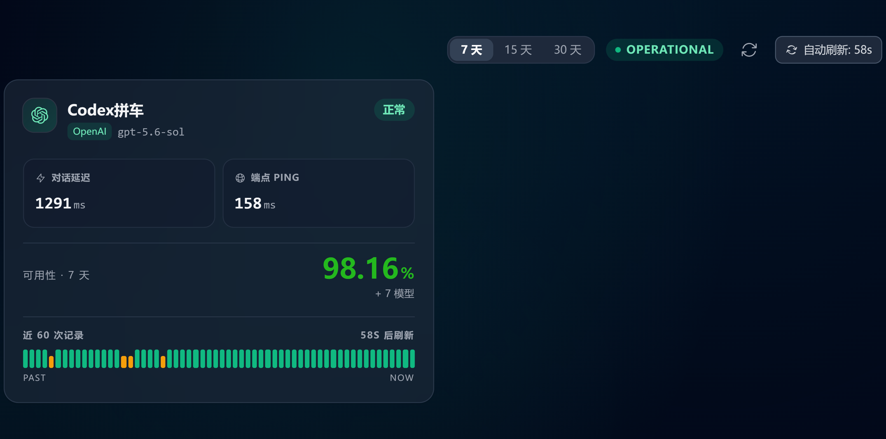
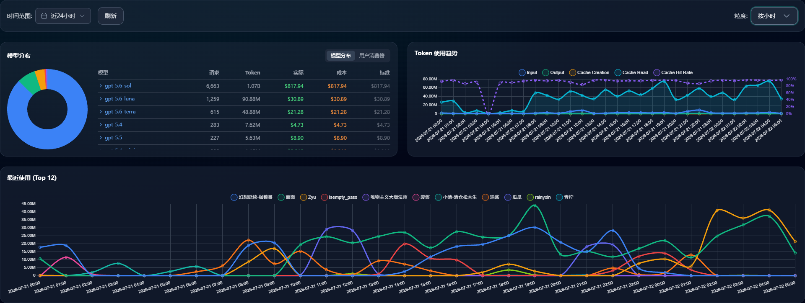

# koishi-plugin-check-sub2api-status

[](https://github.com/VincentZyu233/koishi-plugin-check-sub2api-status)
[](https://gitee.com/vincent-zyu/koishi-plugin-check-sub2api-status)

上游项目：<https://github.com/Wei-Shaw/sub2api>

用于自建 sub2api 的用户监视自己的中转站以及上游渠道的状态捏。

## 效果预览

### 渠道状态

执行 `sub2api-status` 后返回的渠道状态截图：



### 管理仪表盘趋势

执行 `sub2api-trend` 后返回的默认 `A+B+C` 趋势截图：



## 思路

sub2api 前端登录态保存在 `localStorage`：

- `auth_token`
- `refresh_token`
- `auth_user`
- `token_expires_at`

导出 JSON 还会记录登录页的 `origin` 和 `navigator.userAgent`。插件截图前会校验 Origin，设置相同的 User-Agent，再把登录态注入到 `sub2apiBaseUrl` 对应的页面环境里，按指令打开 `/monitor` 或 `/admin/dashboard`。

截图页会根据 `auth_user` 提前标记 sub2api 官方新手引导为已完成，并在截图前再检查 driver.js 引导层。如果新版 sub2api 仍显示引导，插件会通过官方关闭按钮或 `Escape` 销毁遮罩，避免灰色引导层进入截图。

Koishi 只从配置项 `authStateJson`、`enableCustomUserAgent`、`customUserAgent` 以及可选的自动重新登录配置读取认证信息，不会读取或写回任何本地登录态文件。refresh 或重新登录签发的新 token 只保存在插件进程内，并在截图页面关闭前同步回来。

## 导出登录态

推荐使用独立浏览器 profile，不直接读你日常浏览器的 profile。这样不会被 Chrome 文件锁卡住，也不会影响你自己的浏览器会话。

在 Koishi 根目录运行：

```powershell
node .\external\check-sub2api-status\tools\export-auth-state.mjs `
  --browser "C:\Program Files (x86)\Microsoft\Edge\Application\msedge.exe" `
  --url "http://127.0.0.1:8080/monitor" `
  --profile ".\data\sub2api-auth-profile-js"
```

脚本会打开一个浏览器窗口。首次运行时在窗口里登录 sub2api，登录成功进入 `/monitor` 后，脚本会把 Origin、User-Agent 和 localStorage 合并成一份 JSON，在控制台打印，同时写入 `external/check-sub2api-status/tools/output/sub2api-auth-state-YYYYMMDD-HHMMSS.json`。

如果不想依赖 Node/Puppeteer，也可以使用纯 Python 标准库版本。它通过 Chrome DevTools Protocol 导出 localStorage，不需要安装第三方 Python 包：

```powershell
python .\external\check-sub2api-status\tools\export-auth-state.py `
  --browser "C:\Program Files (x86)\Microsoft\Edge\Application\msedge.exe" `
  --url "http://127.0.0.1:8080/monitor" `
  --profile ".\data\sub2api-auth-profile-py"
```

### 导出参数默认值

| 参数 | Node 版默认值 | Python 版默认值 | 说明 |
| --- | --- | --- | --- |
| `-b, --browser` | 依次读取 `CHROME_PATH`、`PUPPETEER_EXECUTABLE_PATH` | 依次读取 `CHROME_PATH`、`PUPPETEER_EXECUTABLE_PATH` | 两个环境变量均未设置时必须传入浏览器可执行文件路径 |
| `-u, --url` | `http://127.0.0.1:8080/monitor` | `http://127.0.0.1:8080/monitor` | sub2api 渠道状态页面地址，必须与需要导出登录态的 Origin 一致 |
| `-p, --profile` | `data/sub2api-auth-profile-js` | `data/sub2api-auth-profile-py` | 独立浏览器 Profile，默认路径相对于运行命令时的当前工作目录 |
| `--profile-mode` | `temporary` | `temporary` | Profile 生命周期，可选 `temporary`、`reuse`、`reset`、`open` |
| `-o, --out` | `tools/output/sub2api-auth-state-YYYYMMDD-HHMMSS.json` | `tools/output/sub2api-auth-state-YYYYMMDD-HHMMSS.json` | 默认文件实际保存在对应导出脚本所在目录的 `output` 子目录 |
| `--timeout` | `600000` 毫秒 | `600000` 毫秒 | 最多等待登录态出现 10 分钟 |
| `--port` | 不支持 | `0` | 仅 Python 版支持，`0` 表示自动选择空闲的 Chrome 调试端口 |

如果实际服务地址不是 `127.0.0.1`，请显式传入 `--url`。例如服务位于局域网 `192.168.31.25` 时，应使用 `--url "http://192.168.31.25:8080/monitor"`，否则导出的登录态会属于不同的浏览器 Origin。

### Profile 生命周期

`--profile-mode` 同时控制 Profile 启动前的处理方式、浏览器退出行为和运行后的清理方式：

| 模式 | 启动前 | 导出后 |
| --- | --- | --- |
| `temporary` | 删除脚本管理的旧 Profile，再创建全新 Profile | 关闭浏览器并删除整个 Profile |
| `reuse` | 复用现有 Profile，不存在则创建 | 关闭浏览器并保留 Profile |
| `reset` | 删除现有 Profile，再创建全新 Profile | 关闭浏览器并保留新的 Profile |
| `open` | 复用现有 Profile，不存在则创建 | 保持浏览器运行并保留 Profile |

默认模式是 `temporary`，因此正常导出不需要显式传入 `--profile-mode`，并且不会在磁盘上遗留浏览器 Profile。导出的登录态 JSON 位于 `tools/output`，不受 Profile 清理影响。

`tools/output` 中的 JSON 只是方便人工复制和备份的导出产物。Koishi 插件不会读取该目录，用户需要把控制台打印的完整 JSON 手动粘贴到 `authStateJson`。

需要复用登录状态时使用 `--profile-mode reuse`；需要丢弃旧登录状态并保留本次新 Profile 时使用 `--profile-mode reset`；需要导出后继续操作浏览器窗口时使用 `--profile-mode open`。

脚本创建的 Profile 会包含 `.sub2api-auth-profile` 标记文件。`temporary` 和 `reset` 只允许删除默认 Profile，或者包含该标记文件的自定义 Profile；磁盘根目录、用户主目录、当前工作目录、脚本目录、符号链接和 Windows Junction 均会被拒绝。任何清理失败都会立即报错并返回非零退出码。

## Koishi 配置

启用 `puppeteer` 服务后启用本插件，保留默认配置即可：

```yaml
check-sub2api-status:
  enableStatusCommand: true
  statusCommandName: sub2api-status
  enableTrendCommand: false
  trendCommandName: sub2api-trend
  trendScreenshotRange: all
  sub2apiBaseUrl: http://127.0.0.1:8080
  enableCustomUserAgent: false
  customUserAgent: ''
  enableAutoRelogin: false
  loginEmail: ''
  loginPassword: ''
  authStateJson: |
    {
      "origin": "http://127.0.0.1:8080",
      "userAgent": "Mozilla/5.0 ...",
      "exported_at": "2026-07-07T07:07:07Z",
      "localStorage": {
        "auth_token": "...",
        "refresh_token": "...",
        "auth_user": "...",
        "token_expires_at": "..."
      }
    }
```

Koishi 控制台会按实际作用范围展示三组截图配置，配置键本身没有变化：

| 配置分组 | 适用范围 | 配置项 |
| --- | --- | --- |
| 🌐 通用截图设置 | `sub2api-status` 与 `sub2api-trend` | `waitUntil`、`waitAfterLoadedMs`、`navigationTimeoutMs`、`deviceScaleFactor`、`imageType`、`imageQuality` |
| 📡 状态页截图设置 | 仅 `sub2api-status` | `viewportWidth`、`viewportHeight`、`waitForSelector`、`fullPage`、`cropRules` |
| 📈 趋势截图设置 | 仅 `sub2api-trend` | `trendScreenshotRange` |

趋势截图固定使用 `2240 × 1200` 视口，并与状态页共用 `deviceScaleFactor` 缩放倍率。趋势页通过 DOM 区域计算截图边界，并等待所有 Chart.js Canvas 出现有效绘制像素且连续 750ms 保持稳定，避免截到空白帧、动画中间帧或响应式缩放中的折线图。趋势截图不会读取状态页的视口、完整页面或裁剪规则配置。`imageQuality` 仅在 JPEG 或 WebP 输出时生效，PNG 会忽略该配置。

把导出脚本控制台打印的完整 JSON 粘到 `authStateJson` 即可。导出的 token 属于敏感信息，`tools/output` 默认会忽略 JSON 文件，不建议提交到仓库。

### User-Agent 选择规则

- `enableCustomUserAgent: false`：使用 `authStateJson.userAgent`，即导出登录态时浏览器的真实 UA。
- `enableCustomUserAgent: true`：忽略导出的 UA，改用 `customUserAgent`。
- 启用自定义 UA 但 `customUserAgent` 为空，或者最终 UA 含有换行符时，插件会在访问 sub2api 前报错。
- 使用旧版脚本导出、不含 `userAgent` 的 JSON 时，需要重新导出，或显式启用自定义 UA。

### Origin 安全校验

`authStateJson.origin` 必须与 `sub2apiBaseUrl` 的 Origin 完全一致，包括协议、主机名和端口。如果不一致，插件会在发出任何 sub2api 请求前强制终止截图，避免会话 IP/UA 绑定因访问链路变化而撤销 refresh-token 家族。

例如，使用 `--url "http://192.168.31.25:8080/monitor"` 导出时，`sub2apiBaseUrl` 也必须填写 `http://192.168.31.25:8080`，不能改用公网域名。Origin 一致只能保证访问地址一致；如果 sub2api 开启会话 IP/UA 绑定，导出脚本与 Koishi 还应使用相同的网络出口。

### 自动刷新与重新登录

`enableAutoRelogin` 默认关闭。关闭时插件仍会在进程内接收并复用 sub2api 前端轮换出的新 token，但 refresh token 已失效后会要求重新导出登录态。

开启后，插件会采用以下顺序维护登录态：

1. 首次截图时在 Puppeteer 页面内调用 sub2api 官方 `/api/v1/auth/refresh`，验证并轮换导出的 refresh token。
2. access token 距离过期不足两分钟时，再次通过官方接口刷新并原子替换 access token、refresh token 与过期时间。
3. 只有 refresh 返回确定性的 `401`、`403` 或 token 撤销错误后，才使用 `loginEmail` 与 `loginPassword` 调用 `/api/v1/auth/login`。
4. 重新登录失败后固定冷却 60 秒，避免错误密码、限流或安全设置不兼容时连续请求登录接口。
5. 页面意外返回认证错误时，单次截图最多重新建立登录态并重试一次，不会形成无限刷新或登录循环。

`authStateJson` 仍然是必填的初始登录态，因为它提供必须校验的 Origin、稳定 User-Agent、用户信息和首次 token。账号密码是 refresh 失效后的兜底，不会替代 Origin 与 UA 安全检查。

#### sub2api 必要配置

| 检查项 | 自动重新登录要求 | 检查位置 |
| --- | --- | --- |
| 登录方式 | 必须是设置了可用本地密码的账号；只有 OAuth 身份而没有本地密码时无法使用 | 使用无痕窗口测试邮箱和密码能否直接登录 |
| 管理员权限 | `sub2api-trend` 使用的账号必须为 `admin` 且状态为 `active` | sub2api 管理后台的用户管理 |
| 账号 TOTP 2FA | 目标账号不能在登录时要求 6 位 TOTP；若返回 `requires_2fa`，插件会停止而不会绕过 | 个人资料 → 安全设置 → 双因素认证 |
| 全局 TOTP | 可以开启，但目标账号自身必须未启用 TOTP | 管理员设置 → 安全 → 双因素认证 |
| Cloudflare Turnstile | 必须关闭；Turnstile token 短时且一次性，不能作为无人值守配置保存 | 管理员设置 → 安全 → Cloudflare Turnstile |
| Session Binding | 可以开启；登录、刷新和截图会在同一 Puppeteer 页面中完成，但 Koishi 的代理、出口 IP 与 UA 必须保持稳定 | 管理员设置 → 安全 → 会话 IP/UA 绑定 |
| Origin | `authStateJson.origin` 与 `sub2apiBaseUrl` 必须完全一致 | Koishi 配置与导出 JSON |

密码字段使用 Koishi 的 `secret` 输入角色，因此控制台会遮罩显示；这不是加密，直接填写的密码仍会以明文持久化到 `koishi.yml`。不要把包含真实密码的配置文件提交到 Git、发送到群聊或附在问题报告中。

开启示例：

```yaml
check-sub2api-status:
  sub2apiBaseUrl: https://sub2api.example.com
  authStateJson: |-
    { "origin": "https://sub2api.example.com", "userAgent": "...", "localStorage": { "auth_token": "...", "refresh_token": "...", "auth_user": "...", "token_expires_at": "..." } }
  enableAutoRelogin: true
  loginEmail: admin@example.com
  loginPassword: 请在本机 Koishi 控制台填写
```

运行期间刷新或重新登录得到的新 token 只保存在内存中，不写入 `authStateJson`、`tools/output` 或其他本地文件。Koishi 重启后会重新验证配置中的初始 refresh token；若它已经被上次运行轮换失效，则使用账号密码创建新的独立会话。

### 诊断日志

调试设置将控制台阶段日志与本地诊断文件分开控制。旧的 `verboseLog` 已直接更名，不保留兼容别名：

| 配置项 | 类型 | 默认值 | 说明 |
| --- | --- | --- | --- |
| `verboseConsoleLog` | `boolean` | `false` | 在 Koishi 控制台输出带同一 `captureId` 的认证、接口、Canvas、裁剪、重试与截图摘要 |
| `verboseFileLog` | `boolean` | `false` | 保存成功或失败页面图片及结构化诊断 JSON；诊断图片可能包含仪表盘业务内容 |
| `verboseFileLogRetention` | `number` | `10` | 状态页/趋势页与成功/失败四种组合分别保留的历史数量，可设置为 1–100 |
| `verboseFileLogPathRelativeToBaseDir` | `string[]` | `cache / check-sub2api-status / diagnostics` | 禁用的只读数组，展示相对于 `ctx.baseDir` 的固定诊断目录 |

文件目录固定为：

```text
<ctx.baseDir>/cache/check-sub2api-status/diagnostics/
├─ status/
│  ├─ latest-success.json + 图片
│  ├─ latest-failure.json + 图片
│  ├─ success/             # 滚动历史
│  └─ failure/             # 滚动历史
└─ trend/
   ├─ latest-success.json + 图片
   ├─ latest-failure.json + 图片
   ├─ success/             # 滚动历史
   └─ failure/             # 滚动历史
```

`latest-success` 与 `latest-failure` 分别更新，下一次成功不会覆盖最近失败现场。第一次截图失败但认证恢复后的第二次重试成功时，两份记录会使用同一个 `captureId`；失败 JSON 会标记 `recoveredByRetry: true`，成功 JSON 会标记 `previousAttemptFailed: true`。

诊断 JSON 只记录安全配置摘要、阶段耗时、HTTP 状态、服务端 `reason`、Canvas 尺寸与采样签名、裁剪区域和错误栈。插件不会把账号、密码、access token、refresh token、Cookie、请求正文、响应正文或完整 localStorage 写入诊断文件，并会对错误文本中意外出现的 Bearer、JWT 和 refresh token 进行二次脱敏。

认证 refresh/login 请求使用 `navigationTimeoutMs` 作为浏览器 `fetch` 超时。超时后请求会通过 `AbortController` 中止并释放认证互斥锁，不会让后续截图永久排队。

## 指令

- `sub2api-status`：截图渠道状态页，默认启用。
- `sub2api-trend [num] [unit]`：截图管理仪表盘趋势区域，默认关闭。启用后会固定使用暗色主题，并以宽屏视口输出所选区域，不依赖状态页的整页裁剪参数。

两条指令均可分别通过 `enableStatusCommand`、`enableTrendCommand` 控制是否注册，也可以通过 `statusCommandName`、`trendCommandName` 修改指令名称。

`sub2apiBaseUrl` 只填写服务根地址，例如 `http://192.168.31.25:8080`。插件会为状态指令自动使用 `/monitor`，并为趋势指令自动使用 `/admin/dashboard`。

### 趋势截图范围

`trendScreenshotRange` 是 Koishi 控制台中的单选配置，按管理仪表盘从上到下划分三个连续区域：

- A：时间范围、刷新按钮和统计粒度。
- B：模型分布与 Token 使用趋势。
- C：最近使用（Top 12）。

| 配置值 | 截图内容 | 接口与渲染检查 |
| --- | --- | --- |
| `all` | A + B + C | 等待仪表盘快照和最近使用接口，并确认三个图表 Canvas 已渲染；这是默认值 |
| `charts-and-recent` | B + C | 等待仪表盘快照和最近使用接口，并确认三个图表 Canvas 已渲染 |
| `recent-only` | C | 只等待最近使用接口并确认对应 Canvas 已渲染，效果与旧版本一致 |

插件根据这些 DOM 区域的实时联合边界截图，不使用固定高度。日期文本、图例数量或图表内容变化时，截图边界会随组件尺寸自动调整。如果 sub2api 后续版本改变了仪表盘层级，插件会明确提示找不到所选区域，而不是返回一张错位图片。

### 趋势时间范围参数

趋势指令接受可选的时间数量和单位，例如：

```text
sub2api-trend
sub2api-trend 12 h
sub2api-trend 24 小时
sub2api-trend 7 d
sub2api-trend 30 天
```

- 不传参数时默认使用 `24 hour`。
- 只传数量时默认使用 `hour`，例如 `sub2api-trend 12` 等同于 `sub2api-trend 12 h`。
- 小时别名为 `h`、`hr`、`hour`、`hours`、`时`、`小时`，允许范围为 1–168。
- 天数别名为 `d`、`day`、`days`、`天`、`日`，允许范围为 1–365。
- 英文单位忽略大小写，数量必须是正整数，参数不合法时不会创建浏览器页面。

`N day` 表示包含今天在内的最近 N 个自然日，并使用 `day` 粒度。`N hour` 会先从当前时间减去 N 小时，再把开始和结束时间转换成 sub2api 接受的日期，并使用 `hour` 粒度。

sub2api 的管理仪表盘接口只接受 `YYYY-MM-DD`，结束日期还会包含完整当天。因此 `6 hour` 可能实际查询今天 00:00 至明天 00:00，跨过午夜时则会覆盖两个完整自然日。这与 sub2api 官方“最近 24 小时”的实现一致，不是严格的滚动 N 小时窗口。

插件通过 sub2api 原生日期输入框和粒度下拉框应用参数，然后等待匹配目标日期与粒度的新接口响应。这样截图 A 区域展示的筛选条件会与 B、C 图表数据保持一致。

## 开发测试

`test/regression/onboarding-tour.mjs` 保留了新手引导遮罩修复的回归测试。脚本会在内存中打包当前 `src/puppeteer.ts`，使用假 Puppeteer Page 验证引导完成键注入、官方关闭按钮以及失败兜底清理，不会启动浏览器、访问网络、读取真实登录态或生成临时构建文件。

`test/regression/trend-screenshot-range.mjs` 记录了 A、B、C 范围设计，验证三档配置映射、DOM 矩形联合、向外取整、默认完整截图，以及 `config.ts` 的 description emoji 约束。

`test/regression/trend-time-range.mjs` 验证趋势指令的默认时间范围、所有中英文单位别名、自然日计算、大小写兼容和范围限制。

`test/regression/auth-auto-relogin.mjs` 验证 token 轮换、默认关闭、401 后密码回退、TOTP 拒绝、并发单次刷新、页面 token 回收和 Origin fail-closed 行为，不读取真实账号、密码或 token。

```powershell
yarn test:onboarding
yarn test:auth
yarn test:diagnostics
yarn test:trend-range
yarn test:trend-time
```
